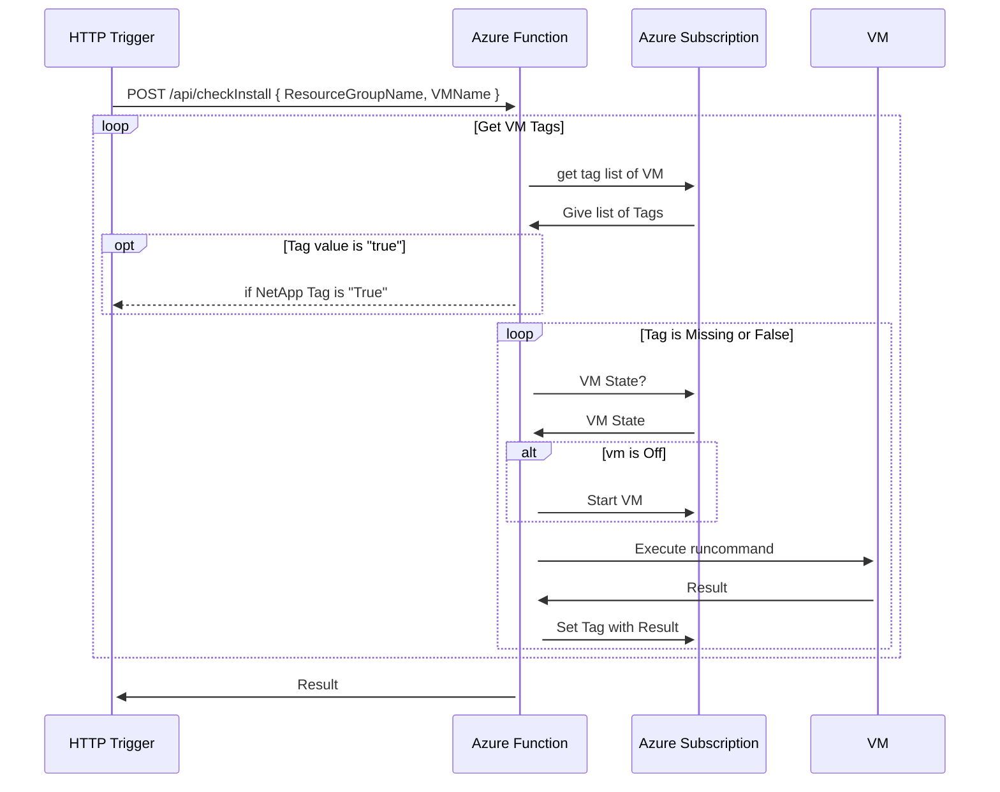

# ANF SQL Server Snapshot scheduler

to work on this project you need Powershell 6 Core as 7 isn't ready yet in Azure Function.
to install it :

``` shell
brew install powershell@6.2.4
brew 
```

## Function 

Overview :
[![](https://mermaid.ink/img/eyJjb2RlIjoiXG5ncmFwaCBURFxuICBBW0hUVFAgQ2FsbF1cbiAgRjQoUHJlU25hcHNob3QtVG9kbylcbiAgRjUoUG9zdFNuYXBzaG90LVRvZG8pXG4gIEEgLS0-fFBPU1QgYXBpL1N0YXJ0UHJvY2Vzc3wgRjAoU3RhcnRQcm9jZXNzKVxuICBBIC0tPiBGNFxuICBBIC0tPiBGNVxuICBGMChTdGFydFByb2Nlc3MpXG4gIEYxKFN0YXJ0Vk0pXG4gIEYyKGNoZWNrSW5zdGFsbClcbiAgRjMoTmV0QXBwU1FMKVxuXG4gIEYwIC0tPnxzZW5kIG1lc3NhZ2UgaW4gc3RhcnR2bXwgUTBcblx0UTAgLS0-fGxpc3RlbiBmb3Igc3RhcnR2bXwgRjEoU3RhcnRWTSlcbiAgRjEgLS0-IHxzZW5kIFZNIFN0YXJ0ZWR8IFExXG4gIFExIC0tPiB8c3RhcnQgY2hlY2tpbmcgaW5zdGFsbGF0aW9ufCBGMlxuICBGMiAtLT4gfG5vdCBpbnN0YWxsZWR8IFEyXG4gIEYyIC0tPiB8aW5zdGFsbGVkfCBRM1xuICBRMiAtLT4gRjNcbiAgRjMgLS0-IFEzXG4gIFEzIC0tPiBGNFxuICBzdWJncmFwaCBpZGUxIFtRdWV1ZXNdXG4gICAgUTA-c3RhcnR2bV1cbiAgICBRMT5jaGVja0luc3RhbGxdXG4gICAgUTI-aW5zdGFsbGF0aW9uXVxuICAgIFEzPmluc3RhbGxlZF1cbiAgICBRWj5lcnJvcl1cbiAgZW5kXG4gIEYxIC4tPiB8c2VuZCBlcnJvcnwgUVpcbiAgRjIgLi0-IHxzZW5kIGVycm9yfCBRWlxuICBGMyAuLT4gfHNlbmQgZXJyb3J8IFFaXG4gIEYwIC4tPiB8c2VuZCBlcnJvcnwgUVpcbiIsIm1lcm1haWQiOnsidGhlbWUiOiJkYXJrIn0sInVwZGF0ZUVkaXRvciI6ZmFsc2V9)](https://mermaid-js.github.io/mermaid-live-editor/#/edit/eyJjb2RlIjoiXG5ncmFwaCBURFxuICBBW0hUVFAgQ2FsbF1cbiAgRjQoUHJlU25hcHNob3QtVG9kbylcbiAgRjUoUG9zdFNuYXBzaG90LVRvZG8pXG4gIEEgLS0-fFBPU1QgYXBpL1N0YXJ0UHJvY2Vzc3wgRjAoU3RhcnRQcm9jZXNzKVxuICBBIC0tPiBGNFxuICBBIC0tPiBGNVxuICBGMChTdGFydFByb2Nlc3MpXG4gIEYxKFN0YXJ0Vk0pXG4gIEYyKGNoZWNrSW5zdGFsbClcbiAgRjMoTmV0QXBwU1FMKVxuXG4gIEYwIC0tPnxzZW5kIG1lc3NhZ2UgaW4gc3RhcnR2bXwgUTBcblx0UTAgLS0-fGxpc3RlbiBmb3Igc3RhcnR2bXwgRjEoU3RhcnRWTSlcbiAgRjEgLS0-IHxzZW5kIFZNIFN0YXJ0ZWR8IFExXG4gIFExIC0tPiB8c3RhcnQgY2hlY2tpbmcgaW5zdGFsbGF0aW9ufCBGMlxuICBGMiAtLT4gfG5vdCBpbnN0YWxsZWR8IFEyXG4gIEYyIC0tPiB8aW5zdGFsbGVkfCBRM1xuICBRMiAtLT4gRjNcbiAgRjMgLS0-IFEzXG4gIFEzIC0tPiBGNFxuICBzdWJncmFwaCBpZGUxIFtRdWV1ZXNdXG4gICAgUTA-c3RhcnR2bV1cbiAgICBRMT5jaGVja0luc3RhbGxdXG4gICAgUTI-aW5zdGFsbGF0aW9uXVxuICAgIFEzPmluc3RhbGxlZF1cbiAgICBRWj5lcnJvcl1cbiAgZW5kXG4gIEYxIC4tPiB8c2VuZCBlcnJvcnwgUVpcbiAgRjIgLi0-IHxzZW5kIGVycm9yfCBRWlxuICBGMyAuLT4gfHNlbmQgZXJyb3J8IFFaXG4gIEYwIC4tPiB8c2VuZCBlcnJvcnwgUVpcbiIsIm1lcm1haWQiOnsidGhlbWUiOiJkYXJrIn0sInVwZGF0ZUVkaXRvciI6ZmFsc2V9)
 
### Archive Functions v1

#### checkInstall

[![](https://mermaid.ink/img/eyJjb2RlIjoic2VxdWVuY2VEaWFncmFtXG5cdEhUVFAgVHJpZ2dlciAtPj4rIEF6dXJlIEZ1bmN0aW9uIDogUE9TVCAvYXBpL2NoZWNrSW5zdGFsbCB7IFJlc291cmNlR3JvdXBOYW1lLCBWTU5hbWUgfVxuICBhY3RpdmF0ZSBBenVyZSBGdW5jdGlvblxuICBsb29wIEdldCBWTSBUYWdzXG4gICAgICBBenVyZSBGdW5jdGlvbiAtPj4rIEF6dXJlIFN1YnNjcmlwdGlvbjogZ2V0IHRhZyBsaXN0IG9mIFZNXG4gICAgQXp1cmUgU3Vic2NyaXB0aW9uIC0-PisgIEF6dXJlIEZ1bmN0aW9uOiBHaXZlIGxpc3Qgb2YgVGFnc1xuICAgIG9wdCBUYWcgdmFsdWUgaXMgXCJ0cnVlXCJcbiAgICAgQXp1cmUgRnVuY3Rpb24gLS0-PiAgSFRUUCBUcmlnZ2VyOiBpZiBOZXRBcHAgVGFnIGlzIFwiVHJ1ZVwiXG4gICAgZW5kXG4gICAgbG9vcCBUYWcgaXMgTWlzc2luZyBvciBGYWxzZVxuICAgICAgQXp1cmUgRnVuY3Rpb24gLT4-KyBBenVyZSBTdWJzY3JpcHRpb246IFZNIFN0YXRlP1xuICAgICAgQXp1cmUgU3Vic2NyaXB0aW9uIC0-PisgQXp1cmUgRnVuY3Rpb24gOiBWTSBTdGF0ZVxuICAgICAgYWx0IHZtIGlzIE9mZlxuICAgICAgICBBenVyZSBGdW5jdGlvbiAtPj4rIEF6dXJlIFN1YnNjcmlwdGlvbjogU3RhcnQgVk1cbiAgICAgIGVuZFxuICAgICAgQXp1cmUgRnVuY3Rpb24gLT4-KyBWTSA6IEV4ZWN1dGUgcnVuY29tbWFuZFxuICAgICAgVk0gLT4-KyBBenVyZSBGdW5jdGlvbjogUmVzdWx0XG4gICAgICBBenVyZSBGdW5jdGlvbiAtPj4rIEF6dXJlIFN1YnNjcmlwdGlvbjogU2V0IFRhZyB3aXRoIFJlc3VsdFxuICAgIGVuZFxuICBlbmRcbiAgICAgICAgQXp1cmUgRnVuY3Rpb24gLT4-KyBIVFRQIFRyaWdnZXI6IFJlc3VsdFxuIiwibWVybWFpZCI6eyJ0aGVtZSI6ImRlZmF1bHQifSwidXBkYXRlRWRpdG9yIjpmYWxzZX0)](https://mermaid-js.github.io/mermaid-live-editor/#/edit/eyJjb2RlIjoic2VxdWVuY2VEaWFncmFtXG5cdEhUVFAgVHJpZ2dlciAtPj4rIEF6dXJlIEZ1bmN0aW9uIDogUE9TVCAvYXBpL2NoZWNrSW5zdGFsbCB7IFJlc291cmNlR3JvdXBOYW1lLCBWTU5hbWUgfVxuICBhY3RpdmF0ZSBBenVyZSBGdW5jdGlvblxuICBsb29wIEdldCBWTSBUYWdzXG4gICAgICBBenVyZSBGdW5jdGlvbiAtPj4rIEF6dXJlIFN1YnNjcmlwdGlvbjogZ2V0IHRhZyBsaXN0IG9mIFZNXG4gICAgQXp1cmUgU3Vic2NyaXB0aW9uIC0-PisgIEF6dXJlIEZ1bmN0aW9uOiBHaXZlIGxpc3Qgb2YgVGFnc1xuICAgIG9wdCBUYWcgdmFsdWUgaXMgXCJ0cnVlXCJcbiAgICAgQXp1cmUgRnVuY3Rpb24gLS0-PiAgSFRUUCBUcmlnZ2VyOiBpZiBOZXRBcHAgVGFnIGlzIFwiVHJ1ZVwiXG4gICAgZW5kXG4gICAgbG9vcCBUYWcgaXMgTWlzc2luZyBvciBGYWxzZVxuICAgICAgQXp1cmUgRnVuY3Rpb24gLT4-KyBBenVyZSBTdWJzY3JpcHRpb246IFZNIFN0YXRlP1xuICAgICAgQXp1cmUgU3Vic2NyaXB0aW9uIC0-PisgQXp1cmUgRnVuY3Rpb24gOiBWTSBTdGF0ZVxuICAgICAgYWx0IHZtIGlzIE9mZlxuICAgICAgICBBenVyZSBGdW5jdGlvbiAtPj4rIEF6dXJlIFN1YnNjcmlwdGlvbjogU3RhcnQgVk1cbiAgICAgIGVuZFxuICAgICAgQXp1cmUgRnVuY3Rpb24gLT4-KyBWTSA6IEV4ZWN1dGUgcnVuY29tbWFuZFxuICAgICAgVk0gLT4-KyBBenVyZSBGdW5jdGlvbjogUmVzdWx0XG4gICAgICBBenVyZSBGdW5jdGlvbiAtPj4rIEF6dXJlIFN1YnNjcmlwdGlvbjogU2V0IFRhZyB3aXRoIFJlc3VsdFxuICAgIGVuZFxuICBlbmRcbiAgICAgICAgQXp1cmUgRnVuY3Rpb24gLT4-KyBIVFRQIFRyaWdnZXI6IFJlc3VsdFxuIiwibWVybWFpZCI6eyJ0aGVtZSI6ImRlZmF1bHQifSwidXBkYXRlRWRpdG9yIjpmYWxzZX0)

