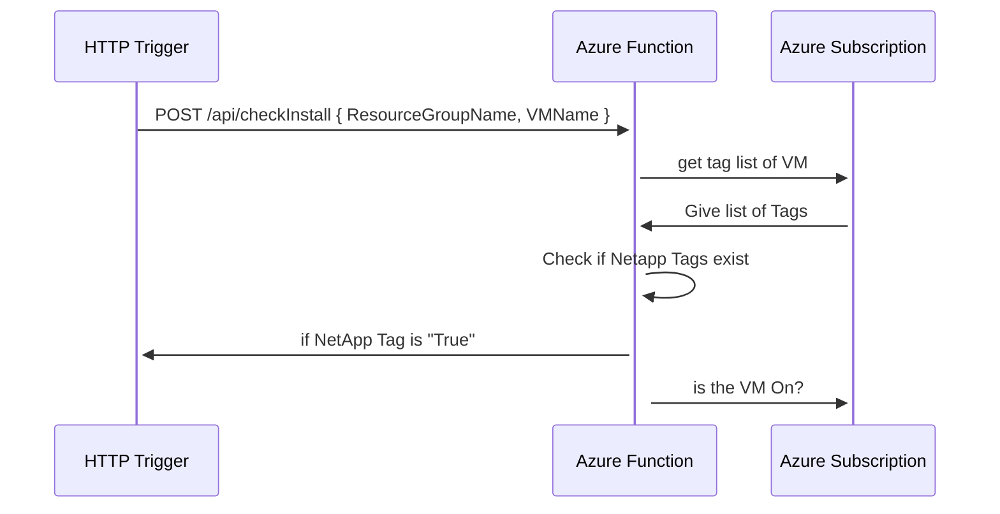

# ANF SQL Server Snapshot scheduler

to work on this project you need Powershell 6 Core as 7 isn't ready yet in Azure Function.
to install it :

``` shell
brew install powershell@6.2.4
brew 
```

## Functions

### checkInstall



this function need a POST request on 